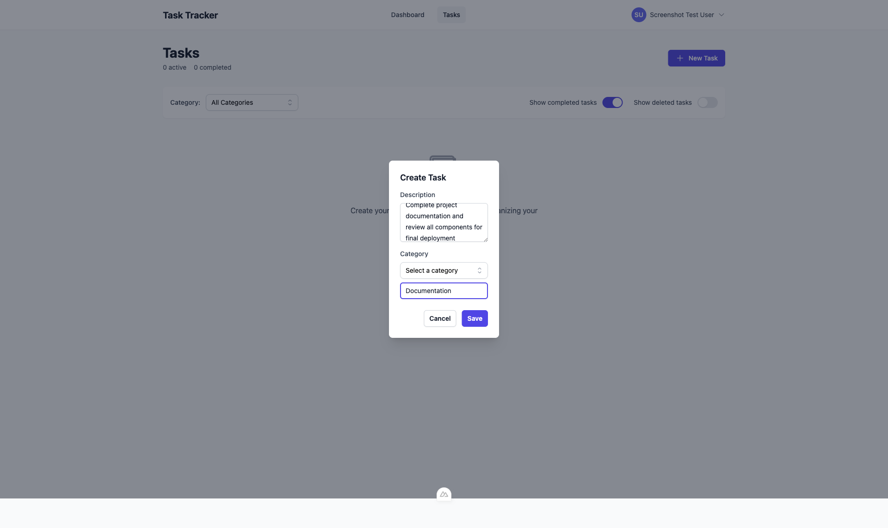

# Application Screenshots

*Generated on: 8/21/2025, 2:18:20 PM*

This document provides a comprehensive visual overview of the Task Tracker application, including all pages, states, and user interactions.

## Overview

The Task Tracker is a full-stack web application built with:
- **Frontend**: Nuxt.js 4, Vue 3, TypeScript, Tailwind CSS
- **Backend**: Go with Gin framework
- **Database**: Redis for session and data storage
- **Authentication**: Session-based with HTTP-only cookies

---

## Authentication

### Homepage - Unauthenticated State


*Captured: 8/21/2025, 2:17:09 PM*

---

### Login Page - Empty Form


*Captured: 8/21/2025, 2:17:13 PM*

---

### Login Page - Validation Errors


*Captured: 8/21/2025, 2:17:16 PM*

---

### Register Page - Empty Form


*Captured: 8/21/2025, 2:17:19 PM*

---

### Register Page - Validation Errors


*Captured: 8/21/2025, 2:17:22 PM*

---

### Register Page - Form Filled Correctly


*Captured: 8/21/2025, 2:17:26 PM*

---

### Registration Success - Redirected to Dashboard


*Captured: 8/21/2025, 2:17:30 PM*

---

## Error States

### 404 Error Page


*Captured: 8/21/2025, 2:18:19 PM*

---

## Main Pages

### Dashboard - Main View


*Captured: 8/21/2025, 2:17:32 PM*

---

### Tasks Page - Empty State


*Captured: 8/21/2025, 2:17:34 PM*

---

### Header Navigation - Logged In State


*Captured: 8/21/2025, 2:17:34 PM*

---

## Task Management

### Task Creation Modal - Empty Form


*Captured: 8/21/2025, 2:17:39 PM*

---

### Task Creation Modal - Form Filled



*Captured: 8/21/2025, 2:17:41 PM*

---

### Tasks Page - With Created Task


*Captured: 8/21/2025, 2:17:46 PM*

---

## Technical Notes

### Screenshot Details
- **Viewport**: 1920x1080 (Desktop)
- **Browser**: Chromium (Playwright)
- **Total Screenshots**: 14
- **Sections Covered**: 4

### How to Update Screenshots

To regenerate these screenshots:

```bash
cd frontend

# Test the system first
npm run screenshots:test

# Capture all screenshots (visible browser)
npm run screenshots

# Or run in headless mode (for CI/automation)
npm run screenshots:headless
```

### Available Commands

- `npm run screenshots` - Interactive mode with visible browser
- `npm run screenshots:headless` - Automated mode for CI/CD
- `npm run screenshots:test` - Quick system verification

### When to Update Screenshots

Update screenshots after:
- **UI Changes**: Any visual modifications to pages or components
- **New Features**: Adding new pages, modals, or functionality  
- **Bug Fixes**: Fixing visual issues or validation problems
- **Before Releases**: Ensure documentation reflects current state
- **Design Reviews**: For stakeholder presentations

### Prerequisites
- Frontend server running on http://localhost:3001
- Backend server running on http://localhost:8080
- Redis server running
- All dependencies installed (`npm install` in frontend directory)

---

*This documentation is automatically generated and should be updated whenever significant UI changes are made.*
